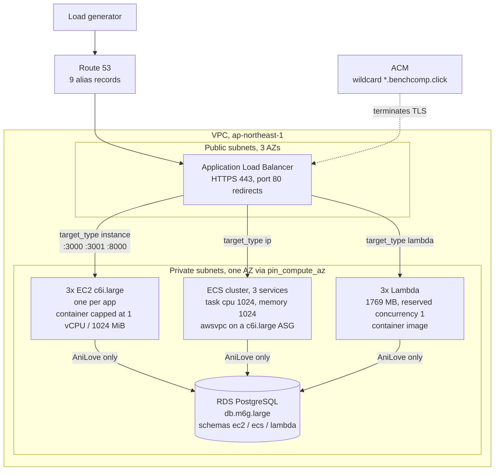

# AWS Performance Benchmark

Compare **EC2**, **ECS on EC2**, and **AWS Lambda** with three instrumented workloads.

One codebase per app, dual entrypoints, dual Docker images. Compare platforms, not different forks.

## What is controlled

The comparison only means something if the compute model is the sole
difference. Each platform gets **one vCPU, 1 GB, and one worker**:

| | EC2 | ECS on EC2 | Lambda |
|---|---|---|---|
| Host | `c6i.large` | `c6i.large` | managed |
| CPU / memory | `--cpus=1 --memory=1024m` | task `cpu=1024`, `memory=1024` | 1769 MB = one full vCPU |
| Workers under load | 1 container | 1 task | reserved concurrency 1 |

Hosts are non-burstable so CPU credits cannot vary between platforms or across
runs. Thread pools are pinned inside the apps (`OMP_NUM_THREADS=1`,
`sharp.concurrency(1)`). `make validate-fairness` checks these hold.

Reasoning: [docs/INFRASTRUCTURE.md](./docs/INFRASTRUCTURE.md#instance-type-choice-why-not-burstable).

The same holds in front of the application. All three platforms sit behind one
load balancer, one certificate and one shared database, reached on a hostname
that selects the target group:



How load and metrics reach these, including the in-region generator and the
three metric sources:
[docs/INFRASTRUCTURE.md](./docs/INFRASTRUCTURE.md#measurement-path).

## Prerequisites

- Docker Desktop with Compose **v2.20+** (root and suite stacks use `include`)
- Node.js and npm (Artillery via `npx`; local load tests)
- **bash** — Git Bash or WSL on Windows; all automation is bash + Node
- GNU Make
- For AWS runs only: AWS CLI v2 with credentials, Terraform **>= 1.5**

`make check` verifies all of the above.

## Start here

Local, no AWS account needed:

```bash
make help                 # list common commands
make local-up             # apps + metrics on Docker
make local-test           # Artillery vs localhost
make local-down
```

Default AWS region: **ap-northeast-1** (Tokyo). Each suite runs a 17.5 minute
schedule, but a full AWS session costs about US$ 10 and takes ~8 hours including
setup and teardown — see [docs/COSTS.md](./docs/COSTS.md).

```bash
make check                                          # tools + credentials
cp terraform/backend.tf.example terraform/backend.tf   # then fill it in
make validate-tf                                    # fmt, validate, tfvars, ECR
make apply
make push-images
make sync-targets                                   # fills the REPLACE_ME targets
make ecs-up
make validate-aws                                   # every target healthy
make validate-fairness                              # only the compute model varies
make bench-anilove                                  # Prometheus + Grafana
make metrics-proxy                                  # HTTP-only stacks; no-op with a domain
make validate-bench                                 # before the 17.5 minute run
make loadgen-sync                                   # stage suites onto the generator
make loadgen-anilove                                # EC2 + ECS + Lambda in parallel
make capture-anilove RUN=<run-id>                   # app_* to disk before teardown
make destroy                                        # or make ecs-down
```

Load comes from an in-region generator (`enable_loadgen = true`), not from this
machine: a workstation uplink cannot supply the measured phase rates, and a
generator that saturates degrades all three platforms unevenly rather than
failing cleanly. `make artillery-anilove` runs the same suite from here and is
for local work and pilots. See
[docs/PARALLEL-BENCHMARK.md](./docs/PARALLEL-BENCHMARK.md).

The repository ships Artillery `target` as `https://REPLACE_ME` and the same
placeholder in the Prometheus app jobs on purpose, so no live endpoint is
published.
`make sync-targets` fills both from Terraform outputs; see
[PROMETHEUS-TARGETS.md](./benchmarks/docs/PROMETHEUS-TARGETS.md) to fill them by
hand.

| Goal | Where |
|------|--------|
| Local path | `make local-up` then `make local-test` |
| Deploy AWS infra | [terraform/README.md](./terraform/README.md) |
| Push images to ECR | `make push-images` |
| Check a config before spending time or money | `make validate` |
| Scripts / automation | [scripts/README.md](./scripts/README.md) |
| AWS load + charts (one suite) | `make bench-anilove` then `make loadgen-anilove` |
| All three suites together | `make bench-anilove bench-csv bench-thumbnail` |
| Calibrate phases before a campaign | `make pilot-anilove` (~7 min probe), then `make pilot-configs` |
| Reduce a campaign to numbers and figures | [Analysis](#analysis) |
| Workload bounds | [docs/WORKLOADS.md](./docs/WORKLOADS.md) |
| Infrastructure design | [docs/INFRASTRUCTURE.md](./docs/INFRASTRUCTURE.md) |
| What a run costs | [docs/COSTS.md](./docs/COSTS.md) |
| Reading the results / paper companion | [docs/PAPER-SSCAD-2026.md](./docs/PAPER-SSCAD-2026.md) |
| IAM | [docs/IAM.md](./docs/IAM.md) |
| Deploy, images, env | [docs/DEPLOY.md](./docs/DEPLOY.md) |
| Parallel Artillery | [docs/PARALLEL-BENCHMARK.md](./docs/PARALLEL-BENCHMARK.md) |
| Suite host ports | [benchmarks/docs/PORTS.md](./benchmarks/docs/PORTS.md) |
| Full doc index | [docs/README.md](./docs/README.md) |

## Validation

Five read-only checks, each wired to a `make` target. They exist because the
failure modes here are silent: a run completes and the dashboards render even
when the configuration invalidates the comparison.

| Target | Checks |
|--------|--------|
| `make validate-tf` | `fmt`, `validate`, backend wiring, tfvars, vCPU parity, ECR images vs `enable_*` |
| `make validate-bench` | Artillery targets and Host headers, pushgateway ports, Prometheus jobs, compose ports |
| `make validate-aws` | Target-group health, ECS counts, EC2 status checks, Lambda state, RDS |
| `make validate-fairness` | Shared metric names, thread pins, worker counts, deployed specs, live `/metrics` |
| `make validate-teardown` | Asks AWS, not Terraform, whether anything billable survived a destroy |

`make validate` runs the two that need no AWS credentials.

## Analysis

A run produces client-side Artillery reports and server-side Prometheus series.
Prometheus lives in the suite's compose stack and dies with it, so **capture
before tearing anything down**.

| Target | Produces |
|--------|----------|
| `make capture-anilove RUN=<run-id>` | `app-metrics-<run-id>.json` — the `app_*` means for that window |
| `make aggregate-anilove` | `per-run.csv`, then median [Q1, Q3] and a Friedman test across repetitions |
| `make figure-anilove RUN=<run-id>` | Phase time series as `.tex` (pgfplots) and `.svg` |
| `make figure-split-anilove` | Latency split into compute, database wait, and overhead |
| `make figure-condition-anilove` | Capped versus uncapped; reads `per-run.csv`, so aggregate first |

`-csv` and `-thumbnail` variants exist for `capture`, `aggregate` and `figure`.
The split and condition figures are AniLove-only: one needs a database wait, the
other Experiment B. Why the test is Friedman and not ANOVA, and why medians
rather than means: [docs/PAPER-SSCAD-2026.md](./docs/PAPER-SSCAD-2026.md).

## Repository layout

```text
apps/                         # one codebase per workload
  anilove/
  csv-processor/
  thumbnail-generator/

benchmarks/                   # AWS metrics suites + Artillery
  docs/
  scripts/
  stack/
  suites/
    anilove/
    csv-processor/
    thumbnail-generator/

local/                        # local apps + metrics + Artillery
  docker-compose.yml
  artillery/

terraform/                    # AWS infrastructure (Tokyo default)
  bootstrap/
  modules/

docs/
docker-compose.yml            # includes local/
Makefile
```

## Apps

| Folder | Workload | Stack | Entrypoints |
|--------|----------|-------|-------------|
| [apps/anilove](./apps/anilove) | REST + PostgreSQL | Node / Express / Sequelize | `server.js` / `index.handler` |
| [apps/csv-processor](./apps/csv-processor) | CSV filter / aggregate | Python / FastAPI / pandas | `uvicorn` / `app.main.handler` |
| [apps/thumbnail-generator](./apps/thumbnail-generator) | Image resize | Node / Express / Sharp | `server.js` / `index.handler` |

Each app has `Dockerfile` (EC2/ECS), `Dockerfile.lambda`, and `/metrics`.

| App | Dominant bound |
|-----|----------------|
| AniLove | I/O / database |
| CSV Processor | CPU + memory |
| Thumbnail Generator | CPU + memory peaks |

Details: [docs/WORKLOADS.md](./docs/WORKLOADS.md).

## Benchmarks

| Path | Role |
|------|------|
| [benchmarks/stack](./benchmarks/stack) | Shared Prometheus, Grafana, pushgateways |
| [benchmarks/suites/anilove](./benchmarks/suites/anilove) | AniLove suite |
| [benchmarks/suites/csv-processor](./benchmarks/suites/csv-processor) | CSV suite |
| [benchmarks/suites/thumbnail-generator](./benchmarks/suites/thumbnail-generator) | Thumbnail suite |
| [benchmarks/docs/PORTS.md](./benchmarks/docs/PORTS.md) | Host ports for concurrent suites |
| [benchmarks/docs/PROMETHEUS-TARGETS.md](./benchmarks/docs/PROMETHEUS-TARGETS.md) | Placeholder scrape targets to fill later |
| [benchmarks/docs/ARTILLERY-TARGETS.md](./benchmarks/docs/ARTILLERY-TARGETS.md) | Artillery base URLs |

| Suite | Prometheus | Grafana | Pushgateways (ECS / EC2 / Lambda) |
|-------|------------|---------|-----------------------------------|
| AniLove | 9090 | 3002 | 9092 / 9093 / 9094 |
| CSV | 9190 | 3102 | 9192 / 9193 / 9194 |
| Thumbnail | 9290 | 3202 | 9292 / 9293 / 9294 |

## Local

| URL | Service |
|-----|---------|
| http://localhost:3000 | AniLove |
| http://localhost:8000 | CSV |
| http://localhost:3001 | Thumbnail |
| http://localhost:9090 | Prometheus |
| http://localhost:3002 | Grafana (`admin` / `admin`) |

Local ports match the AniLove suite. Do not run `benchmarks/suites/anilove` while local is up. CSV and Thumbnail suites can run alongside local.

Local Grafana and JWT defaults are for local use only. Details: [local/README.md](./local/README.md).

## License

MIT. See [LICENSE](./LICENSE).
