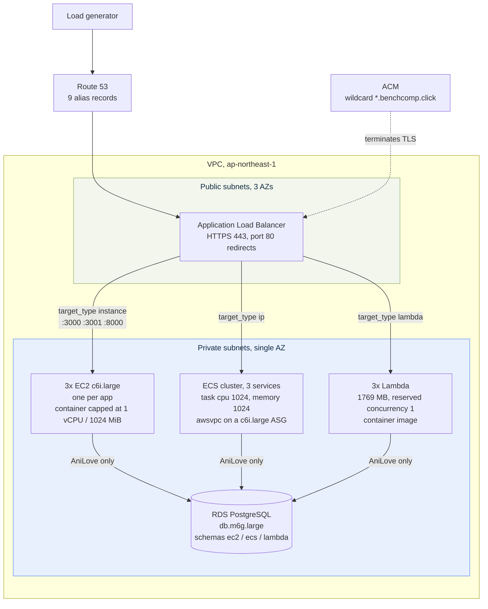
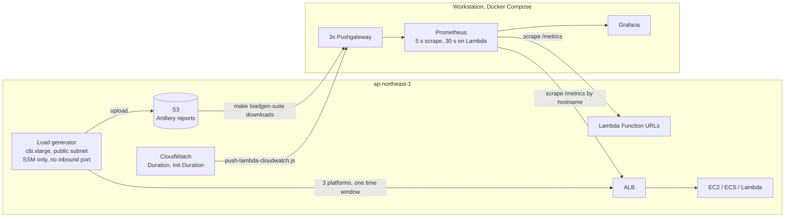

# Target AWS infrastructure

**Region:** ap-northeast-1 (Tokyo).

Same VPC for all components so differences come from the compute model (EC2, ECS on EC2, Lambda), not from network or edge layout.

| Related | Link |
|---------|------|
| Packaging and env | [DEPLOY.md](./DEPLOY.md) |
| Workloads | [WORKLOADS.md](./WORKLOADS.md) |
| Terraform apply | [terraform/README.md](../terraform/README.md) |
| IAM | [IAM.md](./IAM.md) |

## Design goals

1. Equivalent conditions for three apps on three compute models
2. External access uses HTTPS managed by AWS when DNS and ACM are configured (one ALB + ACM for all three platforms; Function URLs stay published for `/metrics`)
3. Isolation between apps (separate EC2 instances, ECS services, Lambda functions)
4. **One** Application Load Balancer for all EC2 and ECS backends
5. **One** ECS cluster with three services (scale idle services to 0 during focused runs)
6. **One** shared RDS for AniLove across EC2, ECS, and Lambda
7. CSV and Thumbnail stay **stateless** (no RDS)

## Network and edge

| Component | Configuration |
|-----------|----------------|
| VPC | Single VPC for EC2, ECS, **all three Lambda functions**, and RDS |
| Availability | Three AZs of subnets, so the ALB has the two it requires. Compute does **not** spread across them: `pin_compute_az = true` places EC2, ECS, Lambda and RDS in the single zone `benchmark_az_index` selects, so inter-AZ latency is not a variable between platforms |
| ALB | One internet facing ALB, IPv4 |
| TLS on ALB | One ACM certificate (DNS validation), one TLS policy on HTTPS 443 |
| HTTP | Listener on 80; redirects to HTTPS when a certificate is set |
| Without domain | ALB can run HTTP only until `domain_name` and `route53_zone_id` are set |
| Lambda edge | Registered as an ALB target when `lambda_behind_alb = true`, so all three platforms share one entrypoint; the Function URL stays published for `/metrics` scrapes |
| DNS | Route 53 aliases for EC2/ECS hostnames to the single ALB |

### HTTPS by platform

| Platform | Path |
|----------|------|
| EC2 | Client to ALB (ACM) to HTTP on the instance |
| ECS on EC2 | Client to the **same** ALB to HTTP on the task |
| Lambda | Client to the **same** ALB (ACM) to the function, when `lambda_behind_alb = true` |

TLS is terminated by the ALB in all three cases, so no application ever pays
handshake or encryption cost. Sending the three platforms through one entrypoint
is what keeps the request path identical; the Function URL remains available as
a second, unmeasured entrypoint for `/metrics`.

### Request path

One entrypoint for all three platforms. A request is routed only by its
hostname, so the path in front of the application is identical and the compute
model is the only thing that differs.



Hostnames are `<label>-<platform>.<domain>` for labels `anilove`, `csv` and
`thumb`. CSV and Thumbnail are stateless and never reach RDS.

### Measurement path

Load is generated in-region. Metrics arrive from three sources, which is why
Lambda's numbers come from CloudWatch rather than only from its own `/metrics`.



The Function URLs stay published so the Lambda scrape does not consume a
concurrency slot on the measured path.

### Hostnames (examples)

Set `domain_name` in Terraform. Artillery and Prometheus targets stay placeholders until apply.

DNS labels are short and uniform, `<label>-<platform>.<domain>`, and all nine
are covered by the single `*.<domain>` wildcard certificate.

| App | Label | EC2 | ECS | Lambda |
|-----|-------|-----|-----|--------|
| AniLove | `anilove` | `anilove-ec2.<domain>` | `anilove-ecs.<domain>` | `anilove-lambda.<domain>` |
| CSV | `csv` | `csv-ec2.<domain>` | `csv-ecs.<domain>` | `csv-lambda.<domain>` |
| Thumbnail | `thumb` | `thumb-ec2.<domain>` | `thumb-ecs.<domain>` | `thumb-lambda.<domain>` |

The Lambda hostnames exist only when `lambda_behind_alb = true`. The Function
URLs stay published either way and remain the endpoint Prometheus scrapes.

| App | Port |
|-----|------|
| AniLove | 3000 |
| Thumbnail | 3001 |
| CSV | 8000 |

Health checks: `GET /health` on each EC2 and ECS target group.

## Database (RDS): AniLove only

**One** PostgreSQL instance for AniLove on all three platforms.

| Aspect | Value |
|--------|--------|
| Class | `db.m6g.large` (non-burstable; see below) |
| Engine | PostgreSQL (version pin in variables) |
| Storage | 20 GiB gp3 (default) |
| Placement | Private subnets |
| Multi AZ | Off |
| Access | Port **5432** only from EC2, ECS, and Lambda security groups |

### Schema isolation

| Platform | `DB_SCHEMA` |
|----------|-------------|
| EC2 | `ec2` |
| ECS | `ecs` |
| Lambda | `lambda` |

The app creates the schema on startup. Concurrent platform load shares RDS CPU and IOPS; schemas isolate data only.

CSV and Thumbnail: **no RDS**.

## EC2

| Item | Configuration |
|------|----------------|
| Region | ap-northeast-1 |
| Instance type | `c6i.large` (non-burstable, no CPU credits) |
| Count | One instance per app |
| Container limits | `--cpus=1 --memory=1024m`, matching the ECS task |
| AMI | Amazon Linux 2023 (pin in `tfvars`, or SSM latest) |
| Public access | Only via shared ALB |
| Security group | Ingress from ALB SG on app ports only |
| Images | `apps/*/Dockerfile` |
| Measurement | Prefer one app under load at a time when comparing a single workload |

## ECS on EC2

| Item | Configuration |
|------|----------------|
| Layout | One cluster, three services |
| Capacity | ASG + capacity provider |
| Instance type | `c6i.large` host; fairness via **task** limits |
| Task | `cpu=1024`, `memory=1024` |
| Network | `awsvpc` |
| Images | Same long running Dockerfiles as EC2 (ECR) |
| ALB | Same shared ALB |
| Measurement | Scale other services to desired count **0** when focusing one app |

## Instance type choice: why not burstable

Earlier revisions of this stack used burstable instances. They were replaced
because they introduced differences between platforms that had nothing to do
with the compute model.

| | Previous | Current |
|---|---|---|
| EC2 apps | `t2.micro` (1 vCPU, 1 GiB) | `c6i.large` (2 vCPU, 4 GiB) |
| ECS hosts | `t3.small` (2 vCPU, 2 GiB) | `c6i.large` (2 vCPU, 4 GiB) |
| Container limits | none; container used the whole instance | `--cpus=1 --memory=1024m` |
| CPU credits | defaults, and the defaults differ | not applicable |
| Cost per hour (Tokyo, 3+3 instances) | $0.127 | $0.642 |

Three problems with the previous setup:

1. **t2 and t3 default to opposite credit modes.** `t2` launches as `standard`
   and throttles to its baseline (~10% of a vCPU) once credits run out. `t3`
   launches as `unlimited` and keeps bursting, billing the surplus. Under a
   sustained load phase, EC2 would collapse while ECS carried on — a
   difference produced by the credit mode, not by EC2 versus ECS.
2. **Credit balance carries across runs.** A 17.5-minute run at high CPU on
   `t2.micro` burns roughly 14 credits while earning 2, and the balance refills
   at 6 per hour. Repeated runs on the same instance therefore measure a
   degrading system rather than repeated samples of the same one, and this
   campaign takes 13 repetitions per workload.
3. **The container was not capped.** `docker run` had no `--cpus`/`--memory`,
   so the EC2 app received the entire instance while the ECS task was limited
   by its task definition. This happened to be equivalent only because
   `t2.micro` is exactly 1 vCPU / 1 GiB; any change of instance size would
   have silently given EC2 more CPU than the other platforms.

`c6i.large` is non-burstable, so none of the above applies. It is the smallest
current-generation x86 instance that is not burstable — AWS offers no 1-vCPU
non-burstable type — so half of each host is deliberately left idle and the
container is capped at 1 vCPU to match the ECS task and Lambda.

### The database follows the same rule

Problem 2 above applies to the database too, and it matters more there than
anywhere else: RDS is shared by all three platforms and sits in the critical
path of AniLove, the only I/O-bound workload, whose headline result is the split
between application time and database wait. A burstable database would let the
credit balance at the start of a run leak straight into that number.

`db.t4g.micro` was therefore replaced with `db.m6g.large` (2 vCPU Graviton2,
8 GiB, non-burstable). Two side effects, both wanted:

- **Performance Insights becomes available.** It is not supported on
  `db.t3`/`db.t4g` micro and small classes. It is now enabled with the free
  7-day retention, so database CPU, connections and top SQL can be reported per
  run instead of assumed.
- **Connection headroom.** `max_connections` scales with memory: roughly 112 on
  `db.t4g.micro` against roughly 900 here. With a Sequelize pool of 20 per
  platform this was never going to bind at the calibrated rates, but it removes
  the ceiling as something to think about.

The cost is $0.221/hour against $0.025, about $1.50 over the whole five-run
protocol. `make validate-tf` fails if a `db.t*` class is configured.

### Using burstable types anyway

Cheap smoke tests do not need `c6i.large`. Set the types back in
`terraform.tfvars` and the `cpu_credits` variable applies the same credit mode
to **both** platforms, which removes problem 1:

```hcl
ec2_instance_type = "t2.micro"
ecs_instance_type = "t3.small"
cpu_credits       = "standard"
```

Problem 2 remains: results from repeated runs are not comparable unless the
instances are recreated between them. `make validate-tf` warns when burstable
types are configured and fails if `cpu_credits` is left unset.

## Lambda

| Item | Configuration |
|------|----------------|
| Packaging | ECR container images (`Dockerfile.lambda`) |
| Memory / ephemeral | 1769 MB memory (one full vCPU) / 1024 MB ephemeral |
| Concurrency | `reserved_concurrent_executions = 1`, matching one EC2 container and one ECS task; `-1` removes the cap |
| Timeout | 30 s |
| Architecture | x86_64 |
| HTTPS | Shared ALB when `lambda_behind_alb = true`; Function URL always published for `/metrics` |
| VPC | **All three** functions attached to the private subnets, not only the one that reaches RDS, so network placement does not vary between platforms or workloads. Requires `AWSLambdaVPCAccessExecutionRole` on every function role |
| AniLove | Secrets injected for RDS access |
| CSV | Python 3.12 + Mangum |
| Thumbnail / AniLove | Node.js 22 + serverless express |

## Load generator

`modules/loadgen`, gated behind `enable_loadgen`. Off by default, but **required
for a real AWS run**: a workstation uplink cannot supply the measured phase
rates — the CSV suite alone asks for about 360 Mbps at the primary rate and
770 Mbps at the stress probe — and a generator that saturates degrades all three
platforms unevenly rather than failing cleanly, which looks like a result.

| Item | Configuration |
|------|----------------|
| Instance | `c6i.xlarge` (`loadgen_instance_type`), deliberately larger than the hosts under test so it is never the bottleneck |
| Placement | Public subnet, same region and VPC as the targets |
| Access | SSM only; no inbound port, no SSH |
| Artillery | Version pinned by `artillery_version`, kept equal to what `run-parallel.sh` resolves locally |
| Transport | An S3 bucket, `force_destroy`. Suites go up, reports come back |

Two Make targets drive it, and they move in opposite directions:

| Target | Direction |
|--------|-----------|
| `make loadgen-sync` | Workstation → S3 → generator. Stages `test-*.yml`, `pilot-*.yml`, processors and fixtures. The generator runs what was last synced, not the working tree, so re-run it after every edit and after `make sync-targets` |
| `make loadgen-<suite>` | Runs the three platforms concurrently on the generator, then downloads the six artifacts into `benchmarks/suites/<suite>/artillery/logs/` |

Client-side metrics come from the downloaded JSON report rather than the
`publish-metrics` plugin: the pushgateways listen on the workstation and the
generator cannot reach them.

## Parameter summary

| Component | Main parameters |
|-----------|-----------------|
| EC2 | `c6i.large`, container capped at 1 vCPU / 1024 MiB; shared ALB |
| ECS | One cluster; task 1024 CPU / 1024 MiB; same ALB |
| Lambda | 1769 MB (one full vCPU), reserved concurrency 1; same ALB |
| TLS | One ACM cert + TLS policy on ALB (when domain set) |
| RDS | One `db.m6g.large`; schemas `ec2` / `ecs` / `lambda` |

## Security groups

| Source | Destination | Port |
|--------|-------------|------|
| Internet | ALB | 443, 80 |
| Internet | Lambda Function URL | 443 (AWS managed) |
| ALB | EC2 / ECS tasks | 3000, 3001, 8000 |
| AniLove compute (EC2, ECS, Lambda) | RDS | 5432 |

No public 5432. No direct public access to app ports on EC2 or ECS.

## Secrets

| Secret | Contents | Consumers |
|--------|----------|-----------|
| `<project>/anilove/db` | username, password, host, port, dbname | AniLove all platforms |
| `<project>/anilove/jwt` | JWT_SECRET | AniLove all platforms |

`DB_SCHEMA` is set per platform in env or Terraform, not in the shared secret. See [IAM.md](./IAM.md).

## Observability

App metrics: `GET /metrics`.

Local and AWS tooling: [local/](../local/), [benchmarks/](../benchmarks/).

After apply, use Terraform outputs or `generated/benchmark-targets.json` to fill:

- `benchmarks/suites/*/prometheus.yml`
- `benchmarks/suites/*/artillery/test-*.yml`

See [PROMETHEUS-TARGETS.md](../benchmarks/docs/PROMETHEUS-TARGETS.md) and [ARTILLERY-TARGETS.md](../benchmarks/docs/ARTILLERY-TARGETS.md).

## Terraform

| Area | Location |
|------|----------|
| Stack | [terraform/](../terraform/) |
| IAM | [IAM.md](./IAM.md), `modules/iam` |
| Remote state | `bootstrap/`, backend in `backend.tf` (gitignored) |
| Pins | AMI, digests, TLS policy, sizes in `variables.tf` |
| Compute flags | `enable_ec2` / `enable_ecs` / `enable_lambda` (default off until images exist) |

Terraform does not build images or run Artillery.

## Repo alignment

| Concern | Support |
|---------|---------|
| Dual images | `apps/*/Dockerfile`, `Dockerfile.lambda` |
| Shared DB + schemas | `DB_SCHEMA`, TLS defaults |
| Stateless CSV / Thumbnail | No DB env |
| HTTPS | One ALB + ACM for all three platforms; Function URL kept for scrapes |
| About 1 vCPU profile | EC2 / task / Lambda sizing; thread pins on CSV and thumbnail |

## Non goals

- Multi AZ RDS
- Separate ALB or ECS cluster per app
- Three RDS instances
- A separate entrypoint per platform. Lambda is an ALB target like EC2 and ECS
  (`lambda_behind_alb = true`); the Function URL stays published only so
  Prometheus can scrape `/metrics` without competing for a concurrency slot on
  the measured path.
